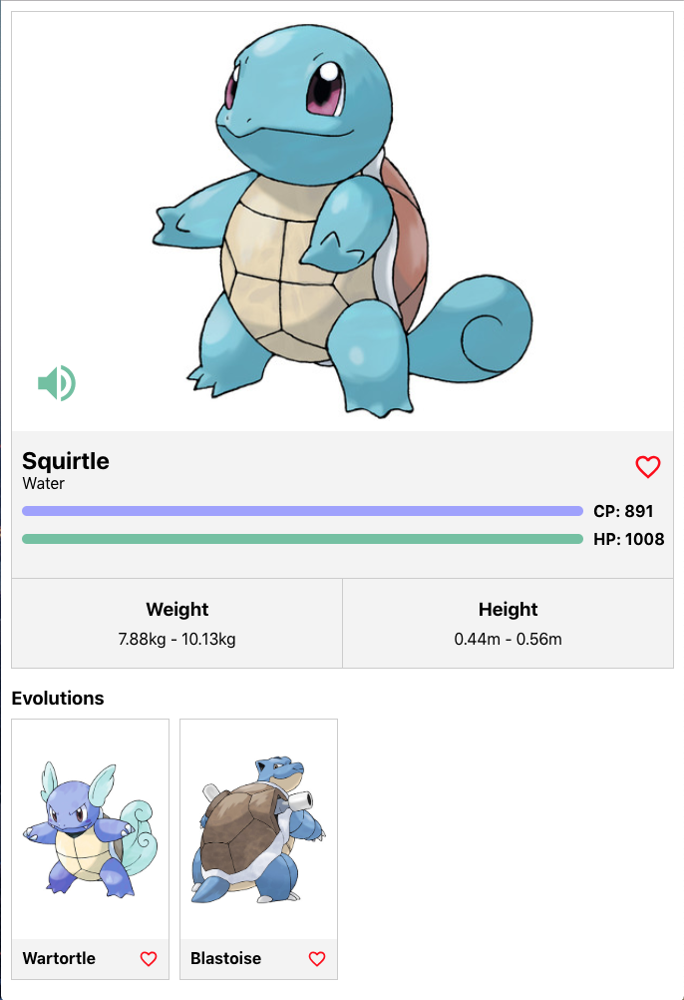

# Coding Exercise Frontend

This repository contains a coding exercise for new developers joining the frontend development team.

Fork this repository and create your own exercise!

## What we want you to build

Your mission is to build a small [Pokedex](https://www.pokemon.com/us/pokedex/) application that looks similar to the next (but remember, you have freedom to express yourself!):

List View           |  Detail View
:-------------------------:|:-------------------------:
 |  

A video example can be found in the example folder in the root of the directory as `example.mov`

The features we expect that your app would contain would be:

- Search for Pokemon by text through use of a search bar.
- Filter Pokemon by type using a dropdown.
- Add and remove a Pokemon to and from your Favorites by clicking the heart icon.
- Use tabs to switch between `All` Pokemon and `Favorite` Pokemon views.
- Change the view from either a grid or list.
- View Pokemon details using a `/:name` route.
- Clicking on a Pokemon image or name should navigate to the above route to view the Pokemon details.

In addition to the above features, below are some optional features that we'd love to see:
- On the Pokemon details page, have a speaker icon that, when clicked, plays the sound of that Pokemon.
- Infinitely scrolled or paginated list to handle on-demand data-fetching for the long list of Pokemon.
- Add a quick view button on the Pokemon list items that shows a modal with more information of the Pokemon.
- Add toast notifications to show success or error messages when adding or removing a Pokemon to and from your Favorites.

## What we provide in this repository

### Backend (`/backend`)
We have provided you with a simple [GraphQL](https://graphql.org/learn) server that serves Pokemon data. The server is non-persistent and therefore on server restart, data will reset.

To run the server:

```
$ cd backend
$ npm install
$ npm start
```

After running the backend, you can access https://localhost:4000/graphql in the browser, you'll be presented with a GraphQL Playground that allows you to run Queries and Mutations as well as view the GraphQL Schema.

A sample query:
```
query { pokemons(query: { limit: 10, offset: 0 }) { edges { name } } }
```

### Frontend (`/frontend`)
This is the place for your code.

### Technology and boilerplate

You are free to use whatever stack you want but what we value the most is [Next.js](https://nextjs.org/) and [Apollo](https://www.apollographql.com/).

Use only what you are comfortable with and feel free to use any additional libraries you deem necessary to complete the exercise. If you want to use a component library, our preferred choice would be [Carbon Design System](https://www.carbondesignsystem.com/). **However**, we would like to see your CSS skills so make sure you show them to us! (layout, animation/transitions...).

### Hints
- There is no need to configure a build, the development environment is sufficient.
- It's recommented to use a CSS pre-processor (Sass).
- Feel free to ask us if you have any doubt or you face any problem!
